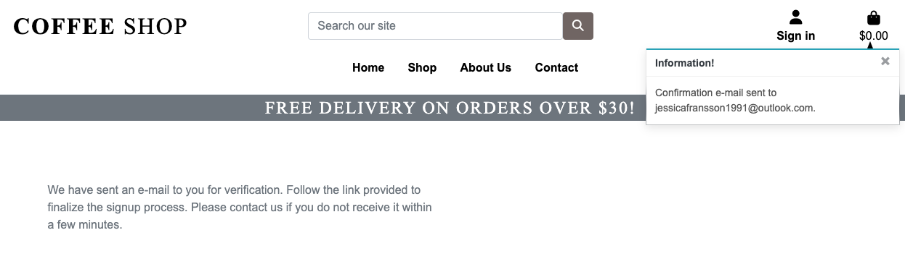
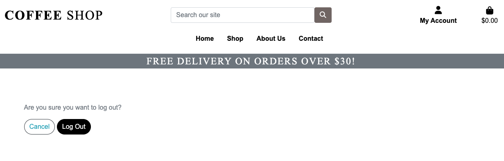

# Coffee Shop

Coffee Shop is an e-commerce website operating in the field for all coffee lovers. 

This fully responsive website was built using the Django framework in Python.

Find my live deployed site [here](https://coffeeshop91.herokuapp.com)

The payment system used is a service called Stripe. To test the payments on this site, dummy card details can be used. A list of these can be found [here](https://stripe.com/docs/testing#cards)


## Content 

[User Experience (UX)](#user-experience-ux)
* [User Stories](#user-stories)
    - [EPIC | Navigation](#EPIC-|-navigation)
    - [EPIC | Accounts](#EPIC-|-accounts)
    - [EPIC | Admin](#EPIC-|-admin)
    - [EPIC | Purchasing](#EPIC-|-purchasing)
    - [EPIC | Interaction](#EPIC-|-interaction)
[Design](#design)
* [Colour Scheme](#colour-scheme)
* [Typography](#typography)
* [Database Schema](#database-schema)
* [Business Model](#business-model)
* [Marketing](#marketing)
* [Search Engine Optimisation](#search-engine-optimisation)

[Features](#features)
* [Nav Bar](#nav-bar)
    - [Links](#links)
    - [Search Bar](#search-bar)
    - [Account](#account)
    - [Bag Icon](#bag-icon)
    - [Banner](#banner)
* [Home page](#home-page)
    - [Hero Image](#hero-image)
    - [Categories](#categories)
    - [Footer](#footer)
* [Accounts](#accounts)
    - [Register Page](#register-page)
    - [Login Page](#login-page)
    - [Log Out Page](#log-out-page)
* [Profile](#profile)
    - [Heading](#heading)
    - [Delivery Details](#delivery-details)
    - [Order History](#order-history)
* [All Products](#all-products)
    - [Sorting](#sorting)
    - [Products](#products)
* [Product Details](#product-details)
    - [Product Info](#product-info)
    - [Like Button](#like-button)
    - [Quantity Buttons](#quantity-buttons)
    - [Customer Reviews](#bag-icon)
    - [Add Review](#add-review)
* [Product Management](#product-management)
    - [Add Product](#add-product)
    - [Edit Product](#edit-product)
    - [Delete Product](#delete-product)
    - [Add Coupon](#add-coupon)
    - [Edit Coupon](#edit-coupon)
    - [Delete Coupon](#delete-coupon)
* [Bag](#bag)
    - [Items](#add-product)
    - [Quantity and Price](#quantity-and-price)
    - [Totals and Messaging](#totals-and-messaging)
    - [Coupons](#coupons)
* [Checkout](#checkout)
    - [Details](#details)
    - [Order Summary](#order-summary)
    - [Payment](#payment)
    - [Loading Spinner](#loading-spinner)
    - [Confirmation](#confirmation)
    - [Webhooks](#webhooks)
* [About Us](#about-us)
    - [Image](#image)
    - [Bio](#bio)
    - [Links](#links)
* [Contact](#contact)
    - [Contact Info](#contact-info)
    - [Messaging](#messaging)
* [Toasts and Pop-ups](#toasts-and-pop-ups)
    - [Toasts](#toasts)
* [Other](#other)
    - [404 Page](#404-page)

[Technologies](#technologies)
* [Languages used](#languages-used)
* [Libraries & Programs Used](#libraries-and-programs-used)

[Testing](#testing)
  
[Deployment](#deployment)
* [Github](#github)
    -[Forking](#forking)
    -[Clone](#clone)
* [Django](#django)
    -[All Auth](#all-auth)
* [Heroku](#heroku)
* [Cloudinary](#connecting-to-cloudinary)
* [Stripe](#Stripe)
    -[Payment](#payments)
    -[Webhooks](#webhooks)

[Credits](#credits)
* [Code](#code)
* [Media](#media)
* [Other](#other)

- [Acknowledgments](#acknowledgments)

--------

## User experience (UX)

The visitors to Coffee Shop is most likely someone who enjoys making nice coffee at home. Who enjoys a nice espresso, or a pour over coffee from whole beans. A visitor to Coffee shop is also someone who most likely enjoys reading about coffee, and the different type of brews there are. 

### User stories 

This is a list of my user stories, and it can also be found [here](https://github.com/users/jessicafransson/projects/8)

#### EPIC | Admin
- As an admin, i can access the products thru the admin site
- As an admin, i can add products to the site
- As an admin, i can add coupons for the site
- As an admin, i can edit/delete the products and coupons for the site
- As an admin, i can view the people signed up for my site

### EPIC | Navigation 
- As a user i can easily navigate around the site to view the different products and sections
- As a user i can view a list of products to select what to order
- As a user i can easily click a product to see more information
- As a user i can easily find out what previous buyers think

### EPIC | Customer
- As a user i want to be able to sign up for an account
- As a user i want to be able to edit my contact information
- As a user i want to add an item to the shopping cart
- As a user i want to be able to update the amount of products in my cart
- As a user i want to be able to delete an item from my cart
- As a user i want to be able to sign up for a newsletter
- As a user i want to be able to see privacy information
- As a user i want to be able to log in/log out easily
- As a user i want to be able to se product information 

### EPIC | Purchase
- As a user i want to view my shopping cart to see the total cost
- As a user i want to easily edit my cart to buy more/less
- As a user i want to see a summary of my products added
- As a user i want to be able to easily enter my payment information to complete a purchase
- As a user i want to easily make an order without having to sign up
- As a user i want to view a confirmation of my order and recieve an email confirmation


[Back to top ⇧](#coffee-shop)
----- 


-------

## Features 

### Home page 

 - ### Navigation bar 
    - The navbar is always visible from the top of the page, and will house links for products, about us, contact form and back to home page. There will also always be access to your account, the shoppingbag and to search the shop.
    - The option to view your account will only be visible when a user is logged in.
    - The option to add products and coupons is only visible to admin users.
    - The shopping bag is always accessible from the navbar, to always be able to check what you've added to your bag, to easily be able to remove and edit the items in your bag. 

------- 


 heroimage
 product view
 account
 about us
 the farm
 flavours 
 reviews
 shopping cart 


- #### Interactivity 

this is what the visitor can do on my site: 

------- 

- #### Footer information 

------

### Accounts 

- user registration

- user login 

- user logout

- user account information 

------

## Admin 

### Add products
### Add coupons 
### Edit products/coupons
### Delete products/coupons 


[Back to top ⇧](#coffee-shop)


-----
## Design

The look for this project is partly inspired by Code Institutes "Boutique Ado" with some finishing touches and styles that i've seen doing research for this project.
I've contacted Gringo Coffee shop who is a roastery here in Sweden and i've gotten their permission to use images and copy their descriptions. You can find their website [here](https://www.gringonordic.se/)

### Color scheme 

I've decided to stick to a basic color scheme of black/white/grey with this project to really highlight the bags of beans, as i find them to have a really nice design - and i wanted them to really pop. 

### Images

- I've gotten my images from Gringo, which is also where i have gotten the inspiration for this website, and the information about their magical beans. 

### Wireframe

I took a lot of inspiration for this project from Code Institutes Boutique Ado, and also from Gringo's website as described above.
I did a start design on Figma to try and set up the main page and view for the products. 

* First mockup looked like this:


* And for the product page like this: 


[Back to top ⇧](#coffee-shop)


### Database Schema 

My database schema is as follows:


### Business Model 

This project will have the business model of B2C (Business to Customer) as the business is selling products directly from their shop to the end user.

### Marketing 

This site represents a fairly new business, where the only current marketing stragety is a facebook page, and signing up for a newsletter.

- Links to social media sites can be found inside the footer

- The facebook link takes you to the Coffee Shop business page which can be found [here](https://www.facebook.com/checkpoint/1501092823525282/?next=https%3A%2F%2Fwww.facebook.com%2FCoffee-Shop-100440999619238%2Finsights%2F%3Freferrer%3Dpage_admin_insights_card)*.
<br>
<i>*Note, this page has unfortunately been deleted, due to facebooks regular deletion of inactive business pages.</i>


### Search Engine Optimisation

I've created a sitemap.xml and a robots.txt file to help aid search engines to locate my site. To keep my users information safe, any pages that could contain sensitive information has been disallowed in the robots.txt file.

The purpose of my About Us page was to be able to shed some light in the ways of brewing coffee, but also use some of our keywords to help boost the site's ranking with search engine results.


#### Short Tail Keywords
- espresso
- ground beans
- filter
- milky drink
- frothed milk
- flat white
- pour over coffee
- brewing type


#### Long Tail Keywords
- Make espresso at home
- How to make café style milk at home
- What beans to use for espresso
- What beans to use for filter coffee
- Difference between espresso and brewed coffee
- Who can drink coffee
- Caffein free coffee
- How to make an americano
- How to mix a flat white

## Features

### Nav Bar

- #### Links

    Checked that:

    - The links change colour when hovered over.
    - The Shop link drops down into a sub-menu displaying all products and the different categories.
    - The links collapse into a hamburger menu once the screen size becomes too small. 

    

- #### Search Bar
    Checked that:
    - The search bar will search both products title and description.
    - On smaller screens, the search bar collapses into a search icon that when clicked dropps into the full search bar

    

- #### Account
    Checked that:
    - Hovering over the account icon changes its colour.
    - When clicking the account a dropdown opens up for the user with options to register or log in.
    - When a user is logged in the dropdown options change to 'My Account' and 'Sign out'.
    - When a user is logged in the icons text changes from 'Sign in' to 'My Account'.
    - When a user is signed in as a super user then a third option of 'Product Management' is available.
    - When a user is signed in as a super user then a fourth option of 'Coupon Management' is available.

    
    
    
- #### Bag Icon
    Checked that:
    - Underneath the bag icon there's a total cost of all the items in the bag.
    - After an item has been added a pop-up shows with the qty of items, and total lost, located at the top right corner.
    - When bag icon is clicked, user get's navigated to the shopping bag where user can see what items are in the bag.

    

### Home Page 

- #### Hero Image
    Checked that:
    - The button for "Shop now" brings the user to the product page
    - Hovering the "Shop Now button works

    

- #### Categories
    Checked that:
    - Hovering the categories works
    - Clicking the category for "espresso" only brings me the correct items

    

- #### Footer 
    Checked that:
    - All the links works with the hoover effect.
    - All the links work and directs to the correct place.
    - Clicking the email address opens up the email programme.
    - Clicking the social media buttons directs to the correct places.

    

### Accounts

- #### Register Page
    Checked that:
    - Submitting the registration form sends a link with an authentication form to the email provided.
    - Clicking the confirmation link takes you to the account page.
    - After creating an account these details works to log in with.

    

    - User fills out this form.

    

    - User get's displayed that the email address needs to be confirmed.

    

    - User checks email to find email confirmation for signing up.

    

    - The link redirects to this page, where the user verifies the email is correct.

    

    - The user can log in with the details provided in the first step. 
    
- #### Login Page
    Checked that:
    - The log in page works for users with already created accounts.
    - Users can sign in using their username.
    - Toast messages are displayed with correct status.

    

- #### Logout Page
    Checked that:
    - The logout page logs out users who are signed in.
    - The account icon turns from "My Account" to "sign in".
    - Toast message informs the user of the status. 

    

### Profile 

- #### Delivery Details
    Checked that:
    - The section in the users account match with address and phone number.
    - The saved information will autofill at the checkout.
    - A toast message will be displayed when details have been updated.

    

- #### Order History
    Checked that:
    - The box with order information displays with date, items, qty and order total.
    - Clicking the order number will direct to page for order confirmation.
    - A scroll function will display when a certain number of orders has reached.
    - The order summary has a redirect button back to profile.

    

- #### Products 
    Checked that:
    - The product page is responsive, adjusting the amount of products displayed depending on screen size.
    - Each product displays an image, title, price, category and rating.
    - If the user is an admin there will be displayed two buttons, one for edit and one for delete.

    

- #### Product detail 
    Checked that:
    - The product detail info shows information about the product, along with buttons to add to cart, and the qty the user wishes to add to the cart.
    - The product rating is an average and will display result in stars, along with comments from users.
    - There is a button for "back to shopping" underneath "add to cart"

    

    - If the user is a superuser the buttons for edit and delete will be displayed underneath the image.

    

- #### Product review
    Checked that:
    - If the product has recieved any reviews it's displayed underneath the image on the product detail page.
    - Since the leave review button is only valid for logged in users, there will be an edit and delete button for the review.

    

    - The review contains the amount of stars given, the comment they've added, the users name and when it was added.

    

    - The users can only add a review if they have an account, and are logged in.
    - If the user isn't logged in, a link will redirect them to loggin in.

    

### Product management

- #### Add a product
    Checked that:
    - The button for adding a product is accessed via the account dropdown menu, under product management.
    - The form can't be submitted with any empty fields.

    

    - The admin gets displayed a successmessage saying the product was added correctly.
    - When product is added, admin gets redirected to the product detail view of the added item.

    


- #### Edit Product
    Checked that:
    - The edit button can be accessed both from all products view, and product detail view.
    - Clicking to edit the product leaves all the forms filled out as is, with options to edit fields. 
    - Clicking the button "Update" saves any changes made to the existing item.

    - The edit button can only be accessed from a logged in admin user.

    

- #### Delete Product
    Checked that: 
    - The delete button can be accessed both from all products view, and product detail view.
    - (At the moment there's no warning before pressing the delete button for admin users on the all products page - it's a feature to fix!)
    - Clicking the delete button triggers a warning with "are you sure you want to delete this item?"
    - Clicking to delte removes it completely from the database. 

    

[Back to top ⇧](#coffee-shop)

- #### Add Coupon
    Checked that:
    - The add coupon is accessible by the account drop down menu, under coupon management.
    - The form displays all the fields for adding a coupon.
    - Clicking the "add coupon" will create a successmessage and the coupon will be added.
    - A list of all added coupons will be displayed at the end of the page, underneath the "add coupon" form.

    

    - There will be a successmessage when clicking the " add coupon " to display the form has been filled out correctly.

    

    - All coupons will be displayed underneath the add coupon form, with notifications if it's valid, the percentage.

     


- #### Edit Coupon
    Checked that:
    - The edit coupon form can be accessed by clicking edit in the coupon view.
    - Pressing the edit button loads the form, which is already filled out with current information.
    - Pressing the update button will save the changes made to this coupon.

    

- #### Delete Coupon
    Checked that:
    - The delete coupon is an icon of a red trash can, that is found at the end of the coupon listed.
    - Clicking the delete coupon button will trigger a warning sign, asking the user if they're sure they want to delete the coupon.
    - If the user clicks delete, the coupon will be deleted from the database.
    - If the user chooses to click cancel, the view will go back to the coupon page in the profile view.

    

### Bag

- #### Items
    Checked that:
    - The shopping bag displays the items added to the bag.
    - Clicking the image in the bag will redirect the user to the product detail page.
    - The added item shows the image, name, price and quantity of the product.
    - Each product has a line to change the qty of the item, or delete it from the bag.

    

- #### Quantity and Price
    Checked that:
    - The qty element button has two sides, one to increase and one to decrease the total.
    - The minus option will disable if the quantity of the item is one.
    - The plus button will disable if the amount added is 99.
    - Clicking the red trash can will completely remove the item from the cart.

- #### Coupons
    Checked that:
    - Underneath the subtotal is a box for adding a coupon code.
    - If the code is valid the user will be displayed with a successmessage saying the code has been added, and the discount will appear in the summary of the cost.
    - If the code added is invalid, an error message will display saying "the code is invalid, please check the details"

    

### Checkout

- #### Details
    Checked that:
    - If the user is anonymous, a link to create an account or login will be present.
    - Any field with the sign * has to be filled out, if left empty, an error message will be displayed.

    

    - If the user is logged in, the box for save information can be checked, and the information will then be saved.
    - If the user is signed in and already has added their information, that will be displayed automatically.
    - Any field with the sign * has to be filled out, if left empty, an error message will be displayed.

    


- #### Order Summary
    Checked that:
    - Clicking the image of the product takes the user to the product detail view.
    - This section will show details of everything in the bag, along with qty and grand total.

    

- #### Payment
    Checked that:
    - Only numbers can be entered in the card payment section. Incorrect card numbers will display an error message.
    - You can make a purchase using a dummy card number: 4242 4242 4242 4242 with the expiry date 04/24 and the CVC code 242.
    - You can either press the option to make purchase, or go back to the shopping bag.

    

- #### Loading Spinner
    Checked that:
    - Once the user clicks confirm order, and as long as the form is valid, the view with a loading spinner will be displayed, until the purchase has been completed.

    

- #### Confirmation
    Checked that:
    - Once the order has been processed the user is taken to the successpage.
    - An email confirmation will be sent to the users given email.
    - After the summary the user can choose to go back to the shop.

    

- #### Webhooks
    Checked that:
    - After the payment has gone thru, the order shows in the webhooks and confirm the order exists.

    


### About Us

- #### Image
    Checked that:
    - Below the image at the about us page there's links for "contact us" and "view our selection".

    

- #### Links
    Checked that:
    - Hovering the links will make them change tone.
    - Clicking the links will direct the user to the correct page.

    

### Contact

- #### Contact Info
    Checked that:
    - Hovering over the social media links will make them change tone. Clicking these links will redirect them to the correct website in a new tab.

    

- #### Messaging
    Checked that:
    - All the fields have a sign showing they are required.
    - When all fields have been filled out the send message button will send the message to the shop.

    

### Toasts

- #### Toasts
    Checked that:
    - Toast messages will appear in the top right corner and will be displayed any time a user has done something on the site.
    - The toast message will display success for all things that has been successful.
    - The toast message will display a red error any time something could not be fulfilled.

    

### Other

- #### 404 Page
    - If any links are broken or the user types a faulty address a 404 page will render.

    


## Technologies 

### languages used:

- [HTML5](https://en.wikipedia.org/wiki/HTML5)
- [CSS3](https://en.wikipedia.org/wiki/Cascading_Style_Sheets)
- [Javascript](https://en.wikipedia.org/wiki/JavaScript)
- [Python](https://www.python.org/)


### Libraries and programs used:

- Git, for version control.
- GitHub, for storing code and deploying site.
- Gitpod, Used to build project and editing the code.
- Django, a python based framework to develop this project
- Bootstrap, for HTML design templates.
- Fontawesome, used to obtain the icons used and created.
- Cloudinary, to store images. 
- Figma, to mockup the design.
- ElephantSQL, database through Heroku.
- W3C for validation of HTML and CSS.
- Pep8CI for validation of Python.
- Jshint, used to validate Python code.
- Crispy forms, to access and render forms on the site.
- Django tempus dominus, used to render date and timepicker for the add coupons.
- Summernote, for usage in the admin panel.
- Heroku, for deploying the project. 
- Stripe, used to make payments and generate webhooks.


## Testing 

Testing and results can be found [here](TESTING.md)

## Deployment

### Github

First you will need to create a new repository.

1. Log into Github.
2. On the 'Repositories' tab click 'New'. This takes you to the create a new repository page.
3. Name the repository and click 'Create repository'.
4. Your new repository is now set up and ready to use.


### Django 

Since this project is created using Django, you need to do following steps to install:

1. In your workspace, type:
    `pip3 install django`
2. To name your project:
    `django-admin startproject *The name of your project here*`
This will add the django project folder in your file explorer
3. Next, add your gitignore file. You do this by typing following in your terminal:
    `touch .gitignore`
4. In this created file, add following lines:
    ```
    *.sqlite3
    *.pyc
    __pycache__
    ```
5. To make sure everything is up and running, run following command:
    `python3 manage.py runserver`
    This will export port 8000. Open it up and you should see a Django success page. 
6. After this it's time for the inital migration. You do this by typing:
    `python3 manage.py migrate`
7. Finally, to have access to the admin panel you will need to create a superuser. This is done by running the command:
    `python3 manage.py createsuperuser`
    Here you will have to create a user by typing in a username, and an optional email address.
8. Once this is done, you can push your changes to GitHub by running following in your terminal:
    ```
    git add .
    git commit -m "initial commit"
    git push
    ```


#### All auth

Within the Django framework, there is a package called Allauth. This package will handle the whole registration and signin process. 
You can find the whole step to install [here](https://django-allauth.readthedocs.io/en/latest/installation.html).

### Heroku 

Heroku is used to deploy the final project.

1. You need to create an account, you can sign up for free [here](https://signup.heroku.com/).
2. Once you are logged in, click the button 'New' and select 'Create new app'.
3. Name the app, then select what region is closest to you and click 'Create App'.
4. Then on the resources tab, navigate to the 'Add-ons' section and search for 'Heroku Postgres'.
5. Select 'Heroku Postgres', then under 'Plan name' choose 'Hobby Dev - Free' and click 'Submit Order Form'.

To use Postgres you will need to install dj_database_url and psycopg2. You do this by typing the following in your terminal:

1. In your IDE type the command:  
    `pip3 install dj_database_url`
2. Then once that is installed type the command:  
    `pip3 install psycopg2-binary`
3. Then, to make sure Heroku install all your apps requirements when you deploy it, run the command:  
    `pip3 freeze > requirements.txt`
4. Next, navigate to your setting.py file in your main project folder. At the top of the file add the line:  
    ```
    import dj_database_url
    ```
5. Then scroll down the file till you find your database settings. Comment out the default configuration and underneath insert the code:  
    ```
    DATABASES = {
        'default': dj_database_url.parse(*Enter Database URL here*)
    }
    ```
    The database URL can be found in the settings tab of your app in heroku, under Config Vars. Make sure to have the link in quotation marks.  
    **Important!** If you want to migrate any data from your current database to the Postgres database in Heroku, make sure you run this line before connecting to Postgres:  
    `./manage.py dumpdata --exclude auth.permission --exclude contenttypes > db.json`  
6. Once that's saved, you will now need to run migrations because you have connected to a new database. This is done by running the command:  
    `python3 manage.py migrate`
    If you had previously saved your data to import into the postgres database, you can now run the command:  
    `./manage.py loaddata db.json`
7. Now that's setup you will now need to create a superuser for the new database. The command is:  
    `python3 manage.py createsuperuser`
    *Note, once the superuser is created, it's a good idea to sign into the admin panel, locate the user, and check the option that says their email is verified. This is needed otherwise Allauth won't allow the user to sign into the store.* 
8. Before you commit these changes, you will need to remove the Databases section in the settings.py and uncomment the original database. This is to stop your Postgres database URL from ending up in version control.
9. Now we can create an if statement in our settings.py to run the postgres database when using the app on heroku or sqlite if not. Scroll back to the database section and refactor the code to look like this:  
    ```
    if 'DATABASE_URL' in os.environ:
        DATABASES = {
            'default': dj_database_url.parse(os.environ.get('DATABASE_URL'))
        }
    else:
        DATABASES = {
            'default': {
                'ENGINE': 'django.db.backends.sqlite3',
                'NAME': BASE_DIR / 'db.sqlite3',
            }
    }
    ```
10. Next we will install another package called gunicorn, which will act as our web server. Do this by running following command:  
    `pip3 install gunicorn`
    And then don't forget to freeze the requirements with:  
    `pip3 freeze > requirements.txt`
11. Now we create our Procfile to tell Heroku to create a web dyno. In your root directory create a file named 'Procfile' and inside insert the code:  
    `web: gunicorn **'your_projects_name_here'**.wsgi:application
12. Then, back in heroku, navigate to settings and in the config vars input the key DISABLE_COLLECTSTATIC with the value 1, and click 'Add'.
This is to stop heroku from collecting any static files when you deploy.
13. You will also need to add heroku to your allowed hosts in your settings.py. Back in your project, in the settings file, scroll down to ALLOWED_HOSTS, and inside the brackets insert the url to your app, followed by 'localhost'. It should look something like this:     
    ```
    ALLOWED_HOSTS = ['your-project-name.herokuapp.com', 'localhost']
    ```
14. Now add, commit and push these changes, followed by a push to heroku with the command:  
    `git push heroku main'
    Your app will now be deployed, albeit without any static files, but this will be fixed when setting up AWS, documented below. 
15. If you want your project to be automatically deployed to heroku when pushing your work to github you can. To do so, In heroku go to the deploy tab, and in the 'deployment method' section connect it to github. You will need to search for your repository and once found click 'connect'. Then scroll down and click 'Enable automatic deploys'. Now when you push to github your code will automatically deploy to Heroku as well. 

[Back to top ⇧](#coffee-shop)

#### Connecting to Cloudinary

To store images and files i've used Cloudinary for this project.

````
Create an account in Cloudinary and follow the steps to link up your project on the site. Log in and create an account on: https://cloudinary.com
````


### Stripe

Stripe is what we use when we need to handle the checkout process when a payment is made. You will need a stripe account which you can sign up for [here](https://stripe.com/en-gb).

#### Payments

1. Follow stripes guide to setup payment [here](https://stripe.com/docs/payments/accept-a-payment#web-collect-card-details).


#### Webhooks 

1. To set up a webhook, sign into your stripe account and click 'Developers' located in the top right of the navbar.
2. Then in the side-nav under the Developers title, click on 'Webhooks', then 'Add endpoint'.
3. On the next page you will need to input the link to your heroku app followed by /checkout/wh/. It should look something like this:  
    ```
    https://your-app-name.herokuapp.com/checkout/wh/
    ```
4. Then click '+ Select events' and check the 'Select all events' checkbox at the top before clicking 'Add events' at the bottom. Once this is done finish the form by clicking 'Add endpoint'.
5. Your webhook is now created and you should see that it has generated a secret key. You will need this to add to your heroku config vars.
6. Head over to your app in heroku and navigate to the config vars section under settings. You will need the secret key you just generated for your webhook, in addition to your Publishable key and secret key that you can find in the API keys section back in stripe.

7. Add these values under these keys:  
    ```
    STRIPE_PUBLIC_KEY = 'insert your stripe publishable key'
    STRIPE_SECRET_KEY = 'insert your secret key'
    STRIPE_WH_SECRET = 'insert your webhooks secret key'
    ```

8. Finally, back in your setting.py file in django, insert the following near the bottom of the file:  
    ```
    STRIPE_PUBLIC_KEY = os.getenv('STRIPE_PUBLIC_KEY', '')
    STRIPE_SECRET_KEY = os.getenv('STRIPE_SECRET_KEY', '')
    STRIPE_WH_SECRET = os.getenv('STRIPE_WH_SECRET', '')
    ```

------

## Credits 

### Code
- Inspiration from both the Walkthru project, former student Delboy and Kera.
- [GringoCoffee](https://www.gringonordic.se/) for images, inspiration with information and the coffee that kept me coding! 

### Media
- As mentioned above most images are from the [Gringo](https://www.gringonordic.se/) website. 
Others from pixabay.

### Other
- The [Djangodocs](https://docs.djangoproject.com/en/4.0/) was a big help for troubleshooting
- [Stackoverflow](https://stackoverflow.com) for trying to find bugs, sollutions and inspiration.
- Creating a sitemap file [here](https://www.xml-sitemaps.com/)
- A lot of inspiration was taken from Code Institutes Boutique Ado, videos and functionality.

------

## Acknowledgements 

- The big support network on slack, alumnis and current students for always beeing there and helping, troubleshooting or rubber-ducking. No one mentioned and no-one therefor forgotten!
- Tutor support for putting up with my brain-fog silly questions


[Back to top ⇧](#coffee-shop)