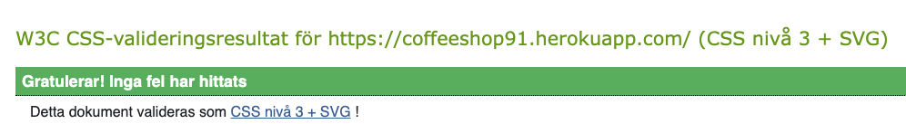

# Coffee Shop - testing

[Visit the live website here](https://coffeeshop91.herokuapp.com/)

---

## Content

* [Validation Testing](#validation-testing)
    * [HTML](#html)
    * [CSS](#css)
    * [JavaScript](#javascript)
    * [Python](#python)
    * [Lighthouse](#lighthouse)
* [Manual testing](#manual-testing)
    * [Testing User Stories](#testing-user-stories)
    * [Full Testing](#full-testing)
* [Bugs](#bugs)
    * [Solved Bugs](#solved-bugs)
    * [Known Bugs](#known-bugs)

Testing has been ongoing throughout building this site, making sure the mobile view is working as it should, and that styles do as expected. 

I've used Chromes devtools to troubleshoot errors and made sure it's responsive on different sizes and devices. 

---

## Validation Testing 

### HTML

[W3C](https://validator.w3.org/) was used to validate all my HTML on the site. As this project is used with Django, i've tested my html  by inspecting the page source and running it through this validator.

| Page | Result |
| Home Page | Pass |
| All Beans | Pass |
| Espresso | Pass |
| Pour Over | Pass |
| About us | Pass |
| Our Farm | Pass |
| Flavour Guide | Pass |
| Contact | Pass |
| Privacy Policy | Pass |
| Terms and Conditions | Pass |
| Delivery | Pass |
| My Account | Pass |
| Product Management | * See comment below * |
| Coupon Management | Pass |
| Bag | Pass |
| Checkout | Pass |
| Checkout Success | Pass |

When testing the front end for adding products i was displayed with following error. 
Since this is part of the Crispy form i couldnt delete the overflowing code.

[HTML Error](assets/images/htmlerror.png)

### CSS

[W3C](https://jigsaw.w3.org/css-validator/) was used to validate my CSS.

