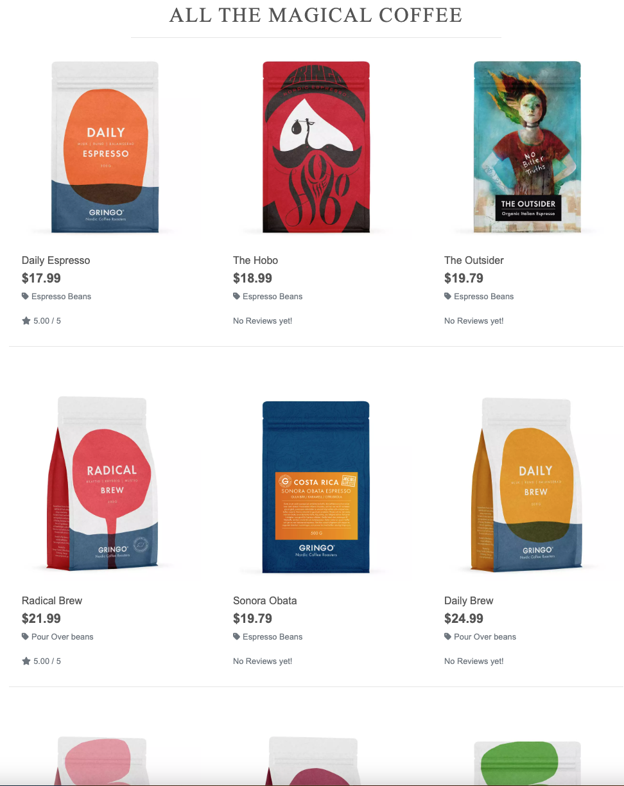
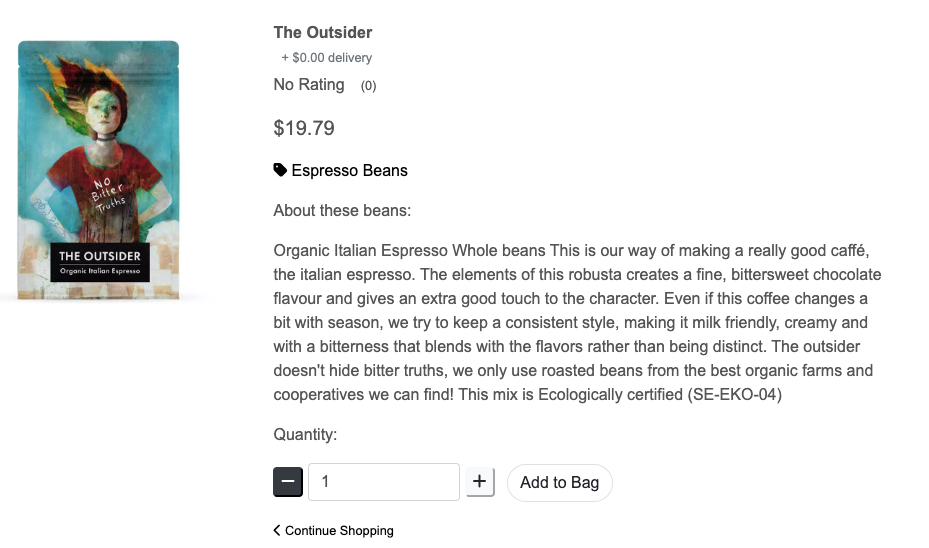
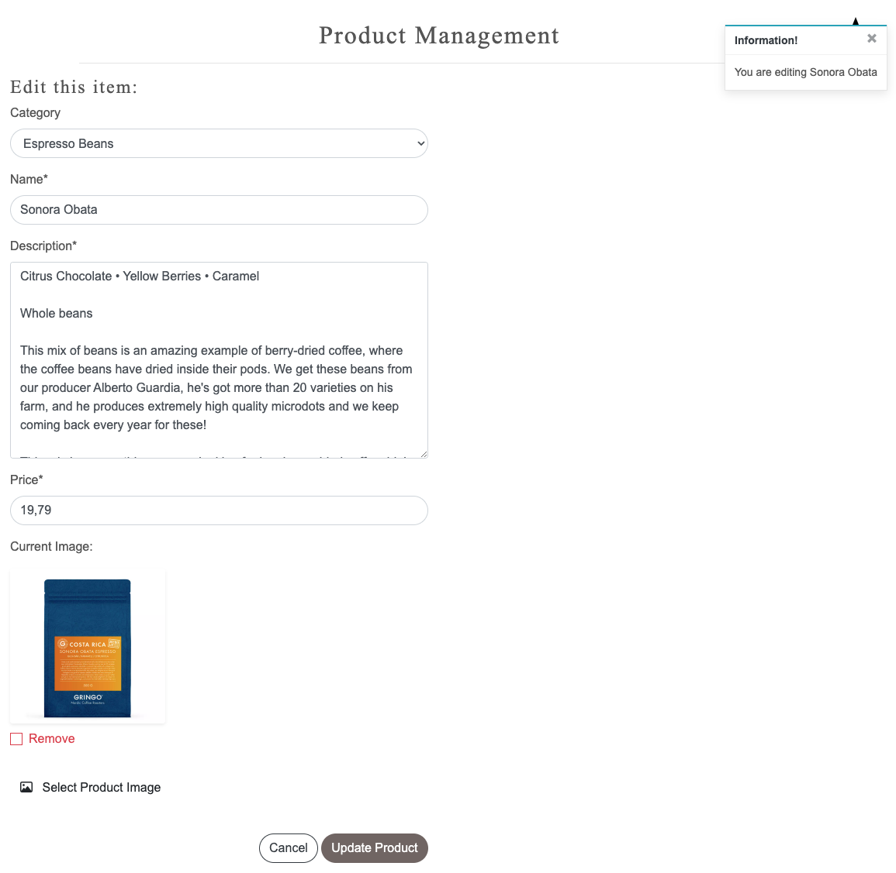
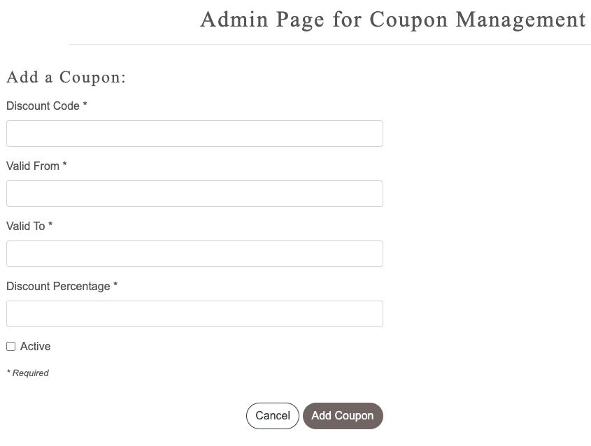
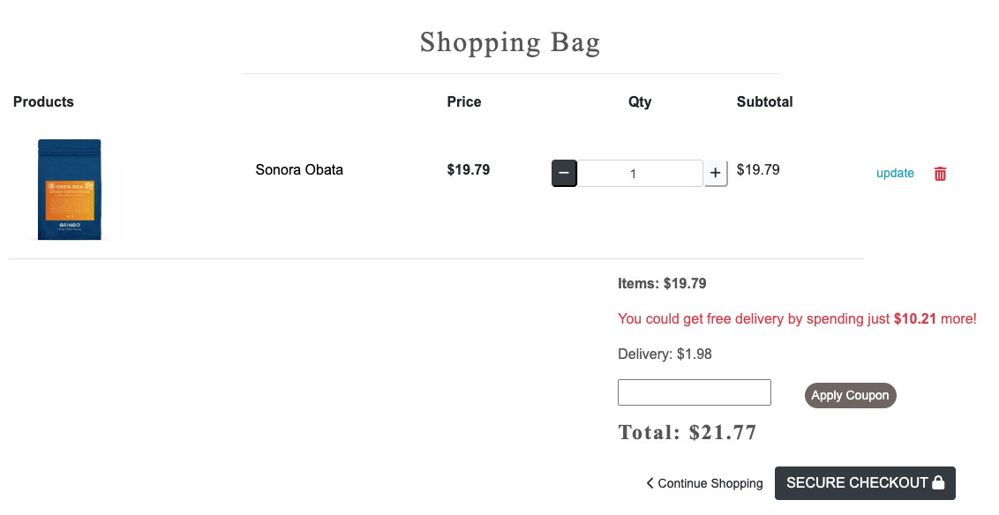
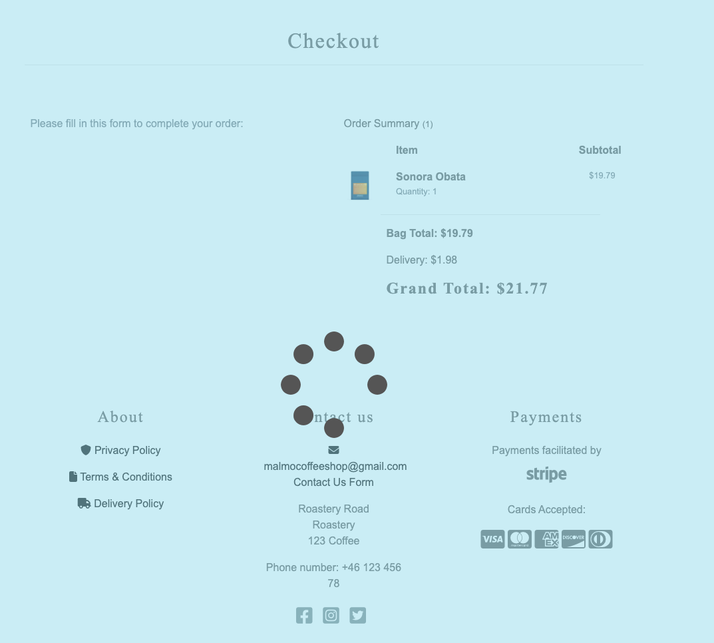

# Coffee Shop - testing

[Visit the live website here](https://coffeeshop91.herokuapp.com/)

---

## Content

[Validators](#validation-testing)
* [HTML](#html)
* [CSS](#css)
* [JavaScript](#jshint)
* [Python](#python)
* [Lighthouse](#lighthouse)

[User Story Testing](user-story-testing)
* [Testing User Stories](#testing-user-stories)
* [Full Testing](#full-testing)

* [Bugs](#bugs)
* [Solved Bugs](#solved-bugs)
* [Known Bugs](#known-bugs)

[Back to top ⇧](#coffee-shop---testing)

Testing has been ongoing throughout building this site, making sure the mobile view is working as it should, and that styles do as expected. 

I've used Chromes devtools to troubleshoot errors and made sure it's responsive on different sizes and devices. 

---

## Validation Testing 

### HTML

- All pages has been tested with the official [W3C Validator](https://validator.w3.org/).

#### Home Page Validation

#### About us Validation

#### Product Page Validation

#### Product Detail Page Validation

#### Add Product Page Validation

#### Edit Product Page Validation

- The add and edit product page shows two errors. These are because the image upload widget and changing this code breaks the field.
#### Coffee Farm Page Validation

#### Flavour Guide Page Validation

#### Profile Page Validation

#### Coupon Page Validation

#### Coupon error Page Validation

#### Edit Coupon error Page Validation

#### Coupon error Page Validation

- The add and edit coupon page shows eight errors. These are because of the datetimepicker widget so it cannot be changed.

[Back to top ⇧](#coffee-shop---testing)

### CSS

- All CSS was checked with official [Jigsaw validator](https://jigsaw.w3.org/css-validator/).

#### Base CSS

#### Bag CSS

#### Profile CSS

[Back to top ⇧](#coffee-shop---testing)

### JSHINT

- All JavaScript was passed thru [Jshint](https://jshint.com/).

### Base

### Products

### Profile

### Bag

### Edit Review

### Checkout

[Back to top ⇧](#coffee-shop---testing)

### PEP8

- PEP8 only shows things that can be ignored

### Lighthouse

- Lighthouse score shows..

[Back to top ⇧](#coffee-shop---testing)

## User Story Testing

### EPIC | Navigation
*As a user I can easily navigate the website to see what to purchase*
- The navigation bar is located at the top of every page. Users can access all pages from here.

- On smaller screens the navbar is located in a hamburger menu that displays when clicked.

*As a user i can easily see a list of items to purchase*

*As a user i can easily see a list of items to purchase*

*As a user i can click an item to read more about it*

### EPIC | Accounts

*As a user i can easily create account to use all the features*
- Users can click the 'Sign in' account icon located in the header, and there choose to sign up. 
- Once on the registration page, the user fills out the form to create an account.

*As a user i can confirm my email address to create my account*
- When filling out the form, an email will be sent with a link the user can click to confirm the email address.

*As a user i can access my account*
- When the link has been clicked and the account is active the user can log in and log out easily from the buttons in the navbar.

*As a user i can log in to my account*

*As a user i can access my profile*
- As a user i can access and edit my profile information.
- As a user i can see my previous purchases in my account.
- If no purchases has been made there's a link taking you to the products.

[Back to top ⇧](#coffee-shop---testing)

### EPIC | Admin
*As an admin, i can access my account from the page*
- Admin users can navigate to the "Product management" under the accounts menu.
- Admin users can also navigate to the "Coupon management" under the accounts menu.

- On this page, the admin user can add a new product by filling out this form:

*As an admin i can update the information about my products to keep them up to date*

*As an admin i can delete products from the product view*

*As an admin i can add coupons to give a discount to my customers*

- All the admin have to do is fill out this form to activate a discount.

- When added successfully this pop-up will be displayed that the coupon was added successfully!

- The admin user can also check what coupons are active and valid at the moment, and choose to edit and delete them.

### EPIC | Purchasing

*As a shopper i can add items to my bag*
- The shopper can in any product detail view add items to the bag, and choose the qty of items.

*As a shopper i can view my bag to see the items in there, and the amount in my bag.*
- The items will remain in the bag until the shopper is ready to purchase them.
- In this view the shopper can also choose to update the amount and delete an item
- The shopper can also always follow the amount total in the bag, and see the total cost with shipping.
- If the shopper has items for less than $ which is the amount for free shipping, there will be a calculator for how much more to spend for free shipping.
- If the user has a coupon code, this is the place to add it to the total amount.

*As a shopper i can easily make a purchase without being logged in*

- Any shopper can add items to the bag, and make a purchase without being logged in.
- The users will be displayed with a form to fill out information, and card details.
- There's a box to tick, if you would like to save your information for the future.

*As a user i can easily pay for my order*

- When the user has pressed to secure checkout, and filled in the payment information it will display a loading view, informing the user that the payment is ongoing.

*As a shopper i get a confirmation after made purchase*

- The user will be displayed with a purchase successful page, where all the information will be displayed

*As a user i get a confirmation email after successful purchase*

- The user will get sent an email confirmation after a successful purchase, with all the information about the items.
- The email also contains a discount code for the next purchase, and contact information to the shop.

[Back to top ⇧](#coffee-shop---testing)

[Back to top ⇧](#coffee-shop---testing)

[Back to top ⇧](#coffee-shop---testing)