# Coffee Shop - testing

[Visit the live website here](https://coffeeshop91.herokuapp.com/)

---

## Content

[Validators](#validation-testing)
* [HTML](#html)
* [CSS](#css)
* [JavaScript](#jshint)
* [Python](#python)
* [Lighthouse](#lighthouse)

[User Story Testing](user-story-testing)
* [Testing User Stories](#testing-user-stories)
* [Full Testing](#full-testing)

* [Bugs](#bugs)
* [Solved Bugs](#solved-bugs)
* [Known Bugs](#known-bugs)

[Back to top ⇧](#coffee-shop---testing)

Testing has been ongoing throughout building this site, making sure the mobile view is working as it should, and that styles do as expected. 

I've used Chromes devtools to troubleshoot errors and made sure it's responsive on different sizes and devices. 

---

## Validation Testing 

### HTML

- All pages has been tested with the official [W3C Validator](https://validator.w3.org/).

#### Home Page Validation

#### About us Validation

#### Product Page Validation

#### Product Detail Page Validation

#### Add Product Page Validation

#### Edit Product Page Validation

- The add and edit product page shows two errors. These are because the image upload widget and changing this code breaks the field.
#### Coffee Farm Page Validation

#### Flavour Guide Page Validation

#### Profile Page Validation

#### Coupon Page Validation

#### Coupon error Page Validation

#### Edit Coupon error Page Validation

#### Coupon error Page Validation

- The add and edit coupon page shows eight errors. These are because of the datetimepicker widget so it cannot be changed.

[Back to top ⇧](#coffee-shop---testing)

### CSS

- All CSS was checked with official [Jigsaw validator](https://jigsaw.w3.org/css-validator/).

#### Base CSS

#### Bag CSS

#### Profile CSS

[Back to top ⇧](#coffee-shop---testing)

### JSHINT

- All JavaScript was passed thru [Jshint](https://jshint.com/).

### Base

### Products

### Profile

### Bag

### Edit Review
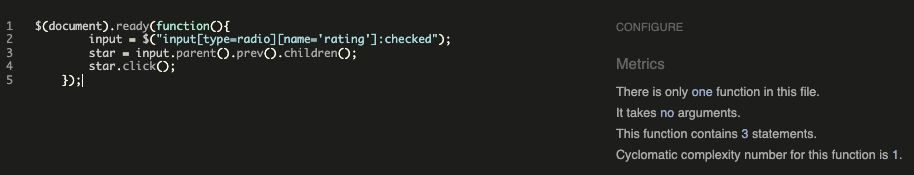
### Checkout

[Back to top ⇧](#coffee-shop---testing)

### PEP8

- PEP8 only shows things that can be ignored

### Lighthouse

- Lighthouse score shows..

[Back to top ⇧](#coffee-shop---testing)

## User Story Testing

### EPIC | Navigation
*As a user I can easily navigate the website to see what to purchase*
- The navigation bar is located at the top of every page. Users can access all pages from here.

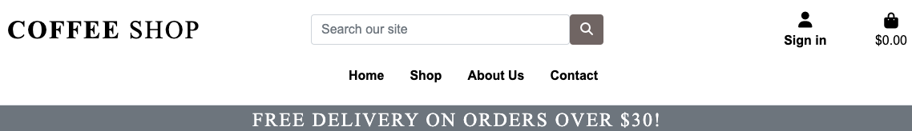

- On smaller screens the navbar is located in a hamburger menu that displays when clicked.

*As a user i can easily see a list of items to purchase*

*As a user i can easily see a list of items to purchase*

*As a user i can click an item to read more about it*

### EPIC | Accounts

*As a user i can easily create account to use all the features*
- Users can click the 'Sign in' account icon located in the header, and there choose to sign up. 
- Once on the registration page, the user fills out the form to create an account.

*As a user i can confirm my email address to create my account*
- When filling out the form, an email will be sent with a link the user can click to confirm the email address.

*As a user i can access my account*
- When the link has been clicked and the account is active the user can log in and log out easily from the buttons in the navbar.

*As a user i can log in to my account*

*As a user i can access my profile*
- As a user i can access and edit my profile information.
- As a user i can see my previous purchases in my account.
- If no purchases has been made there's a link taking you to the products.

[Back to top ⇧](#coffee-shop---testing)

### EPIC | Admin
*As an admin, i can access my account from the page*
- Admin users can navigate to the "Product management" under the accounts menu.
- Admin users can also navigate to the "Coupon management" under the accounts menu.

- On this page, the admin user can add a new product by filling out this form:

*As an admin i can update the information about my products to keep them up to date*

*As an admin i can delete products from the product view*

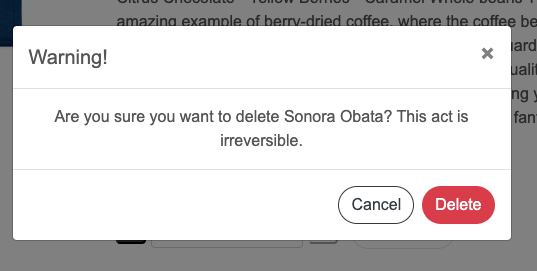

*As an admin i can add coupons to give a discount to my customers*

- All the admin have to do is fill out this form to activate a discount.

- When added successfully this pop-up will be displayed that the coupon was added successfully!

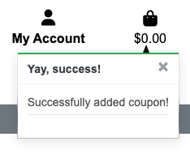

- The admin user can also check what coupons are active and valid at the moment, and choose to edit and delete them.

### EPIC | Purchasing

*As a shopper i can add items to my bag*
- The shopper can in any product detail view add items to the bag, and choose the qty of items.

*As a shopper i can view my bag to see the items in there, and the amount in my bag.*
- The items will remain in the bag until the shopper is ready to purchase them.
- In this view the shopper can also choose to update the amount and delete an item
- The shopper can also always follow the amount total in the bag, and see the total cost with shipping.
- If the shopper has items for less than $ which is the amount for free shipping, there will be a calculator for how much more to spend for free shipping.
- If the user has a coupon code, this is the place to add it to the total amount.

*As a shopper i can easily make a purchase without being logged in*

- Any shopper can add items to the bag, and make a purchase without being logged in.
- The users will be displayed with a form to fill out information, and card details.
- There's a box to tick, if you would like to save your information for the future.

*As a user i can easily pay for my order*

- When the user has pressed to secure checkout, and filled in the payment information it will display a loading view, informing the user that the payment is ongoing.

*As a shopper i get a confirmation after made purchase*

- The user will be displayed with a purchase successful page, where all the information will be displayed

*As a user i get a confirmation email after successful purchase*

- The user will get sent an email confirmation after a successful purchase, with all the information about the items.
- The email also contains a discount code for the next purchase, and contact information to the shop.

### EPIC | Interaction

*As a user i can leave reviews on products to share tips with others*
- To write a review is located on the right side at the end of the product detail page.
- Once the review has been left it will be visible on the left side, with the amount of stars filled in.
- If a user has already left a review, the box on the left will be gone, with a text that a review has already been written.

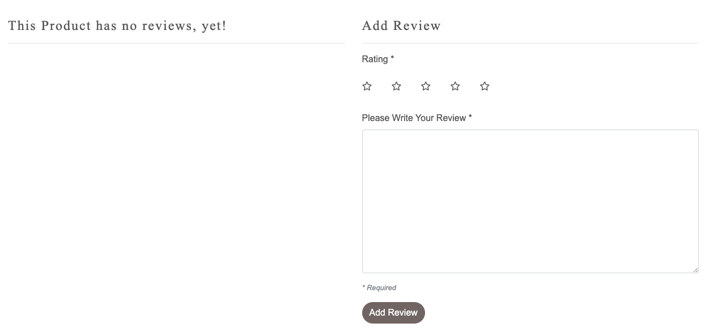

- If the user isn't logged in they see this view, redirecting to log in to leave a review

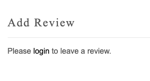

- When the review has been successfully left, it will be displayed like this:
- currently there's a bug for the user to edit their review. It is under construction.

*As a user i can contact the shop owner with questions*

- The contact us form contains a form the user can fill out to leave a message to the company with ideas or complaints.
- If the user doesn't want to send a message there's a button displayed which re-directs the user back to previous page.

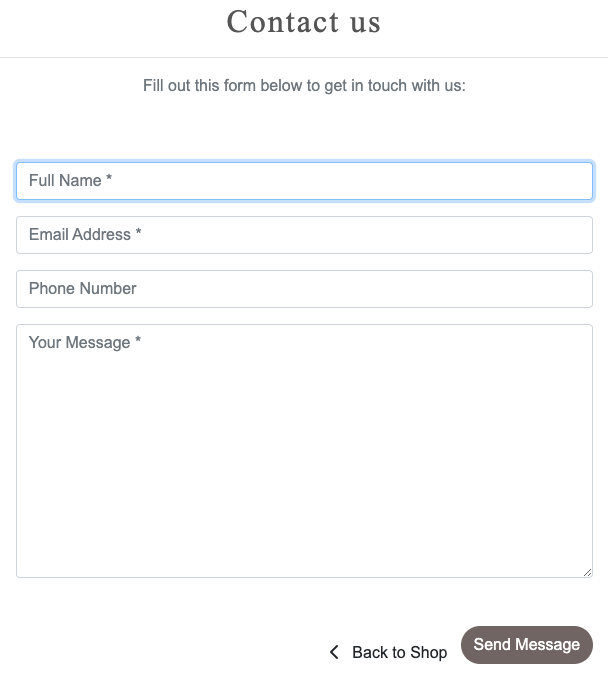

*As a user i can sign up for a newsletter*

- The user can at the footer of every page sign up for a newsletter for the shop.

- When the form has been filled out correctly a message pops up saying "thank you for subscribing".

*As a user i can find information about the shop, and how to contact them*

- The user can find the information about the shop in the footer of each page with address, email and phone number
- There's also a link here directly to the contact form

*As a user i can read more about the shop and founders*

- As a user i can read more information about coffee shop as a company
- As a user i can also go directly to the beans from this page via the shop link
- As a user i can also go directly to contact us via a link on this page.

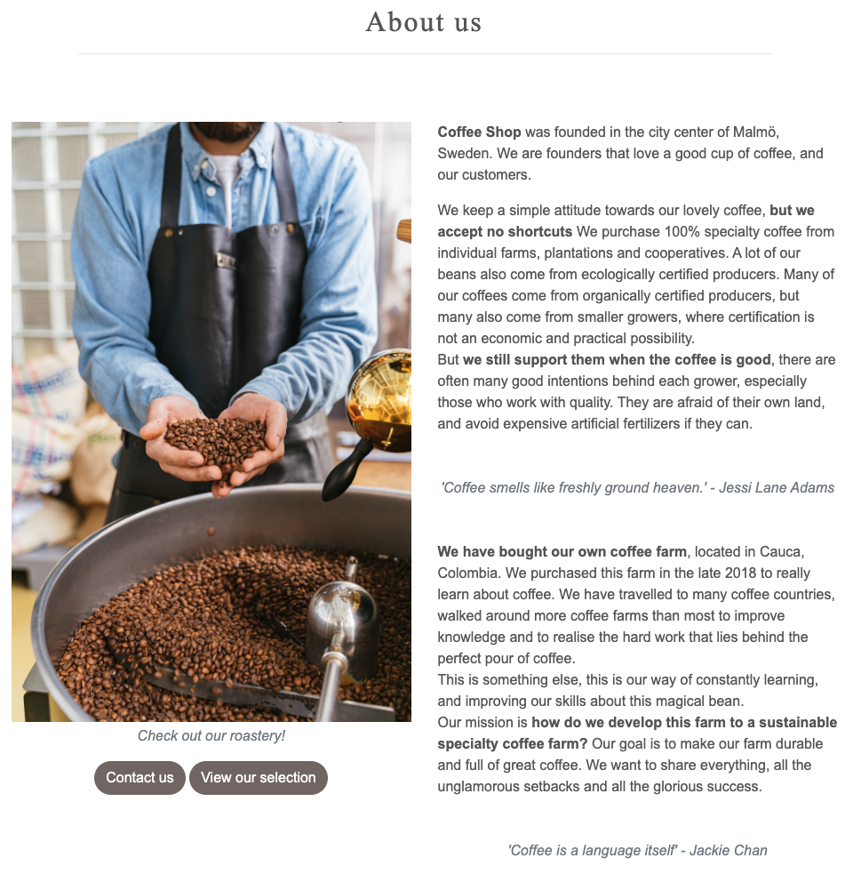

*As a user i can read more about the farm they own*

- As a user i can read more about the work they do on their farm, and their purpose
- As a user i can also go directly to the beans from this page via the shop link
- As a user i can also go directly to contact us via a link on this page.

*As a user i can get more information about different type of beans and flavours*

- As a user i can learn more about different type of beans, and how the roast affects the flavour.
- As a user i can also go directly to the beans from this page via the shop link
- As a user i can also go directly to contact us via a link on this page.

[Back to top ⇧](#coffee-shop---testing)

## Feature testing

### Nav Bar

- #### Links

    Checked that:

    - The links change colour when hovered over.
    - The Shop link drops down into a sub-menu displaying all products and the different categories.
    - The links collapse into a hamburger menu once the screen size becomes too small. 

    

- #### Search Bar
    Checked that:
    - The search bar will search both products title and description.
    - On smaller screens, the search bar collapses into a search icon that when clicked dropps into the full search bar

    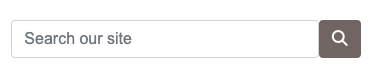

- #### Account
    Checked that:
    - Hovering over the account icon changes its colour.
    - When clicking the account a dropdown opens up for the user with options to register or log in.
    - When a user is logged in the dropdown options change to 'My Account' and 'Sign out'.
    - When a user is logged in the icons text changes from 'Sign in' to 'My Account'.
    - When a user is signed in as a super user then a third option of 'Product Management' is available.
    - When a user is signed in as a super user then a fourth option of 'Coupon Management' is available.

    
    
    
- #### Bag Icon
    Checked that:
    - Underneath the bag icon there's a total cost of all the items in the bag.
    - After an item has been added a pop-up shows with the qty of items, and total lost, located at the top right corner.

    

    - When bag icon is clicked, user get's navigated to the shopping bag where user can see what items are in the bag.

    

### Home Page 

- #### Hero Image
    Checked that:
    - The button for "Shop now" brings the user to the product page
    - Hovering the "Shop Now button works

    

- #### Categories
    Checked that:
    - Hovering the categories works
    - Clicking the category for "espresso" only brings me the correct items

    

- #### Footer 
    Checked that:
    - All the links works with the hoover effect.
    - All the links work and directs to the correct place.
    - Clicking the email address opens up the email programme.
    - Clicking the social media buttons directs to the correct places.

    

[Back to top ⇧](#coffee-shop---testing)

### Accounts

- #### Register Page
    Checked that:
    - Submitting the registration form sends a link with an authentication form to the email provided.
    - Clicking the confirmation link takes you to the account page.
    - After creating an account these details works to log in with.

    

    - User fills out this form.

    

    - User get's displayed that the email address needs to be confirmed.

    

    - User checks email to find email confirmation for signing up.

    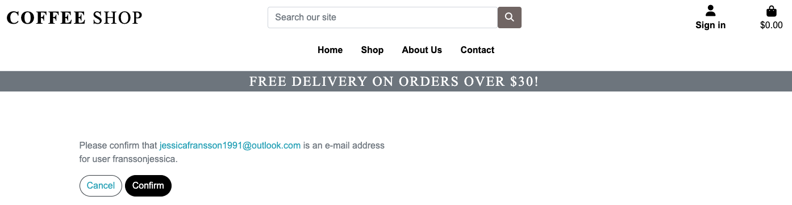

    - The link redirects to this page, where the user verifies the email is correct.

    

    - The user can log in with the details provided in the first step. 
    
- #### Login Page
    Checked that:
    - The log in page works for users with already created accounts.
    - Users can sign in using their username.
    - Toast messages are displayed with correct status.

    

- #### Logout Page
    Checked that:
    - The logout page logs out users who are signed in.
    - The account icon turns from "My Account" to "sign in".
    - Toast message informs the user of the status. 

    

[Back to top ⇧](#coffee-shop---testing)

### Profile 

- #### Delivery Details
    Checked that:
    - The section in the users account match with address and phone number.
    - The saved information will autofill at the checkout.
    - A toast message will be displayed when details have been updated.

    

- #### Order History
    Checked that:
    - The box with order information displays with date, items, qty and order total.
    - Clicking the order number will direct to page for order confirmation.
    - A scroll function will display when a certain number of orders has reached.
    - The order summary has a redirect button back to profile.

    

- #### Products 
    Checked that:
    - The product page is responsive, adjusting the amount of products displayed depending on screen size.
    - Each product displays an image, title, price, category and rating.
    - If the user is an admin there will be displayed two buttons, one for edit and one for delete.

    

- #### Product detail 
    Checked that:
    - The product detail info shows information about the product, along with buttons to add to cart, and the qty the user wishes to add to the cart.
    - The product rating is an average and will display result in stars, along with comments from users.
    - There is a button for "back to shopping" underneath "add to cart"

    

    - If the user is a superuser the buttons for edit and delete will be displayed underneath the image.

    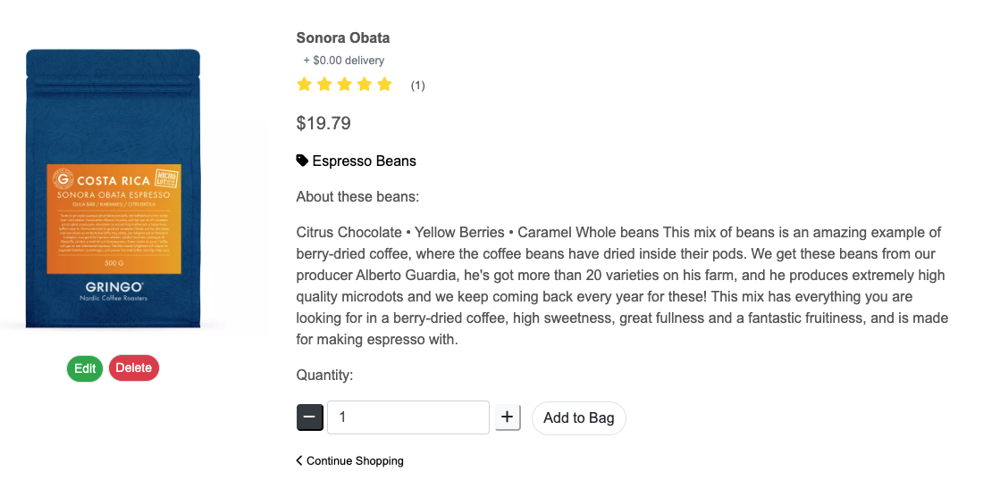

- #### Product review
    Checked that:
    - If the product has recieved any reviews it's displayed underneath the image on the product detail page.
    - Since the leave review button is only valid for logged in users, there will be an edit and delete button for the review.

    

    - The review contains the amount of stars given, the comment they've added, the users name and when it was added.

    

    - The users can only add a review if they have an account, and are logged in.
    - If the user isn't logged in, a link will redirect them to loggin in.

    

[Back to top ⇧](#coffee-shop---testing)

### Product management

- #### Add a product
    Checked that:
    - The button for adding a product is accessed via the account dropdown menu, under product management.
    - The form can't be submitted with any empty fields.

    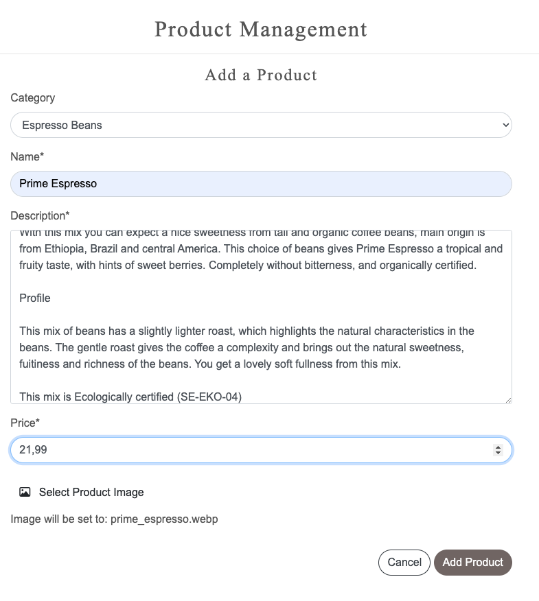

    - The admin gets displayed a successmessage saying the product was added correctly.
    - When product is added, admin gets redirected to the product detail view of the added item.

    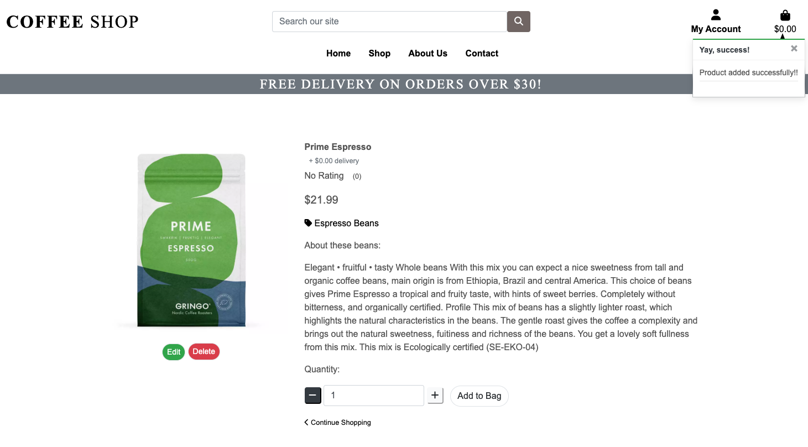

- #### Edit Product
    Checked that:
    - The edit button can be accessed both from all products view, and product detail view.
    - Clicking to edit the product leaves all the forms filled out as is, with options to edit fields. 
    - Clicking the button "Update" saves any changes made to the existing item.

    - The edit button can only be accessed from a logged in admin user.

    

- #### Delete Product
    Checked that: 
    - The delete button can be accessed both from all products view, and product detail view.
    - (At the moment there's no warning before pressing the delete button for admin users on the all products page - it's a feature to fix!)
    - Clicking the delete button triggers a warning with "are you sure you want to delete this item?"
    - Clicking to delte removes it completely from the database. 

    

- #### Add Coupon
    Checked that:
    - The add coupon is accessible by the account drop down menu, under coupon management.
    - The form displays all the fields for adding a coupon.
    - Clicking the "add coupon" will create a successmessage and the coupon will be added.
    - A list of all added coupons will be displayed at the end of the page, underneath the "add coupon" form.

    

    - There will be a successmessage when clicking the " add coupon " to display the form has been filled out correctly.

    

    - All coupons will be displayed underneath the add coupon form, with notifications if it's valid, the percentage.

     

    

- #### Edit Coupon
    Checked that:
    - The edit coupon form can be accessed by clicking edit in the coupon view.
    - Pressing the edit button loads the form, which is already filled out with current information.
    - Pressing the update button will save the changes made to this coupon.

    

- #### Delete Coupon
    Checked that:
    - The delete coupon is an icon of a red trash can, that is found at the end of the coupon listed.
    - Clicking the delete coupon button will trigger a warning sign, asking the user if they're sure they want to delete the coupon.
    - If the user clicks delete, the coupon will be deleted from the database.
    - If the user chooses to click cancel, the view will go back to the coupon page in the profile view.

    

### Bag

- #### Items
    Checked that:
    - The shopping bag displays the items added to the bag.
    - Clicking the image in the bag will redirect the user to the product detail page.
    - The added item shows the image, name, price and quantity of the product.
    - Each product has a line to change the qty of the item, or delete it from the bag.

    

- #### Quantity and Price
    Checked that:
    - The qty element button has two sides, one to increase and one to decrease the total.
    - The minus option will disable if the quantity of the item is one.
    - The plus button will disable if the amount added is 99.
    - Clicking the red trash can will completely remove the item from the cart.

- #### Coupons
    Checked that:
    - Underneath the subtotal is a box for adding a coupon code.
    - If the code is valid the user will be displayed with a successmessage saying the code has been added, and the discount will appear in the summary of the cost.
    - If the code added is invalid, an error message will display saying "the code is invalid, please check the details"

    

### Checkout

- #### Details
    Checked that:
    - If the user is anonymous, a link to create an account or login will be present.
    - Any field with the sign * has to be filled out, if left empty, an error message will be displayed.

    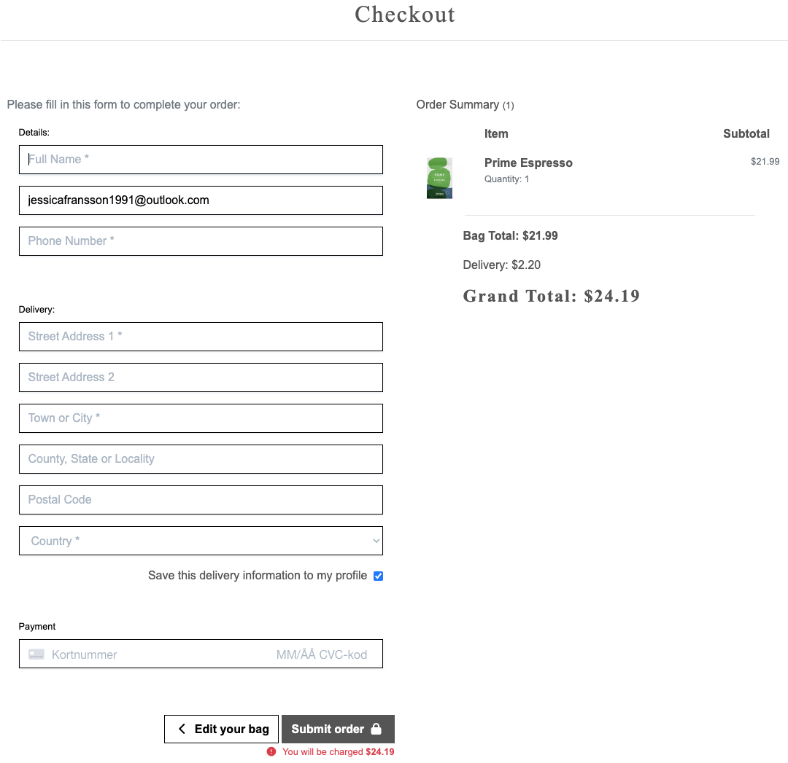

    - If the user is logged in, the box for save information can be checked, and the information will then be saved.
    - If the user is signed in and already has added their information, that will be displayed automatically.
    - Any field with the sign * has to be filled out, if left empty, an error message will be displayed.

    

- #### Order Summary
    Checked that:
    - Clicking the image of the product takes the user to the product detail view.
    - This section will show details of everything in the bag, along with qty and grand total.

    

- #### Payment
    Checked that:
    - Only numbers can be entered in the card payment section. Incorrect card numbers will display an error message.
    - You can make a purchase using a dummy card number: 4242 4242 4242 4242 with the expiry date 04/24 and the CVC code 242.
    - You can either press the option to make purchase, or go back to the shopping bag.

    

- #### Loading Spinner
    Checked that:
    - Once the user clicks confirm order, and as long as the form is valid, the view with a loading spinner will be displayed, until the purchase has been completed.

    

- #### Confirmation
    Checked that:
    - Once the order has been processed the user is taken to the successpage.
    - An email confirmation will be sent to the users given email.
    - After the summary the user can choose to go back to the shop.

    

- #### Webhooks
    Checked that:
    - After the payment has gone thru, the order shows in the webhooks and confirm the order exists.

    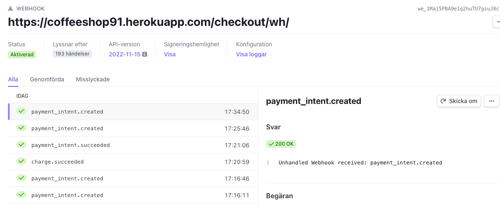

### About Us

- #### Image

- #### Links

### Contact

- #### Contact Info

- #### Messaging

### Toasts

- #### Toasts

### Other

- #### 404 page

- #### Newsletter 

## Bugs

### Fixed

### Unfixed

[Back to top ⇧](#coffee-shop---testing)